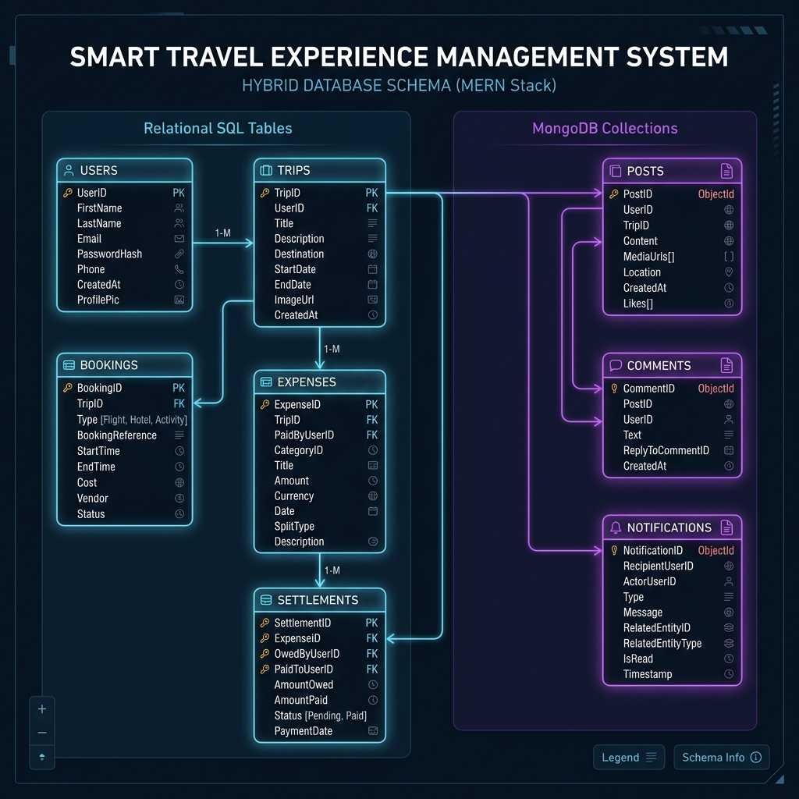

# STEMS (Smart Travel Experience Management System)

Live Application: https://stems-ruby.vercel.app

STEMS is a full-stack group travel management application. It centralizes trip planning, itinerary management, group expense splitting, and community updates into a single web platform.

## Features

- **Trip Management**: Create and organize trips, set date boundaries, manage destinations, and invite members with role-based permissions (Organizers vs Members).
- **Expense Splitting**: Automated expense tracking and group expense settlement with calculated balances between members.
- **Bookings & Itineraries**: Centralized tracking for flights, hotels, and activities associated with each trip.
- **Social Feed & Activity**: Share photos, posts, and comments within specific trips or across the community.
- **Admin Dashboard**: System administration tools for user management, system metrics, and audit log viewing.

## Tech Stack

| Frontend | Backend | Databases | Authentication & Tools |
| --- | --- | --- | --- |
| React 18 + Vite | Node.js + Express | MySQL (Relational Data) | JWT Authentication |
| Tailwind CSS | JavaScript | MongoDB (Document Data) | Axios, React Router DOM |

## Project Structure

```text
STEMS/
├── backend/
│   ├── config/          # Database configuration (MySQL & MongoDB)
│   ├── controllers/     # Route handlers for auth, trips, expenses, etc.
│   ├── middleware/      # Auth & error handling middleware
│   ├── models/          # MongoDB schemas & data access models
│   ├── routes/          # Express route definitions
│   └── services/        # Business logic layer
├── frontend/
│   ├── src/
│   │   ├── components/  # Modular UI components (Auth, Feed, Trips, Admin)
│   │   ├── context/     # Global state (AuthContext)
│   │   ├── hooks/       # Custom React hooks
│   │   ├── pages/       # Page-level route views
│   │   └── services/    # API interaction services
│   └── vercel.json      # Frontend deployment configuration
└── README.md
```

## Database Schema

STEMS employs a dual-database architecture, using MySQL for structured transactional data and MongoDB for flexible social and logging activities.

### Schema Relationships Diagram



### Relational Schema (MySQL)

We structure relational tables inside MySQL with foreign keys, cascaded deletes, indexes, and unique compound constraints to guarantee ACID safety:

1. **users**: Login credentials, user display names, and roles (admin, user).
2. **trips**: Group trip itineraries with titles, capacities, dates, and status codes.
3. **trip_members**: Junction table connecting users to trips. Prevents duplicate joins.
4. **bookings**: Accommodation, flight, and transport trackers. Enforces a compound unique constraint to block duplicate bookings.
5. **expenses**: Shared purchases paid by group members.
6. **expense_splits**: Individual split items showing how much each member owes for a given expense.
7. **settlements**: Payments made between trip members to balance outstanding debt sheets.

### Document Schemas (MongoDB)

Our NoSQL collections track high-volume social activity, alert systems, and security footprints:

* **posts**: Trip-scoped social feed updates (accepts text and variable arrays of image URLs).
* **comments**: Text replies mapped to posts with author references.
* **reactions**: Post likes. Unique compound indexes { postId: 1, userId: 1 } prevent double-likes.
* **notifications**: User alert channels. Uses a unique idempotencyKey index (type:userId:referenceId) to block duplicate notification spams.
* **audit_logs**: System administration audit trails logging exact API calls, changes (before and after), IP addresses, and user-agents.

## Getting Started

### Prerequisites

- Node.js (v18.x or higher)
- MySQL Server (v8.0+)
- MongoDB (v6.0+ or MongoDB Atlas)

### Installation

1. Clone the repository:
   ```bash
   git clone https://github.com/siddhanthh/Smart-Travel-Experience-Management-Systems.git
   cd Smart-Travel-Experience-Management-Systems
   ```

2. Setup the backend:
   ```bash
   cd backend
   npm install
   # Create a .env file with MYSQL_URI, MONGO_URI, and JWT_SECRET
   npm run dev
   ```

3. Setup the frontend:
   ```bash
   cd ../frontend
   npm install
   # Create a .env file with VITE_API_URL=http://localhost:5000/api
   npm run dev
   ```

## Deployment

- **Frontend**: Deployed on Vercel
- **Backend**: Deployed on Render
- **Relational Data**: Deployed on Railway (MySQL Database)
- **Document Data**: MongoDB Atlas Cluster


## License

MIT
